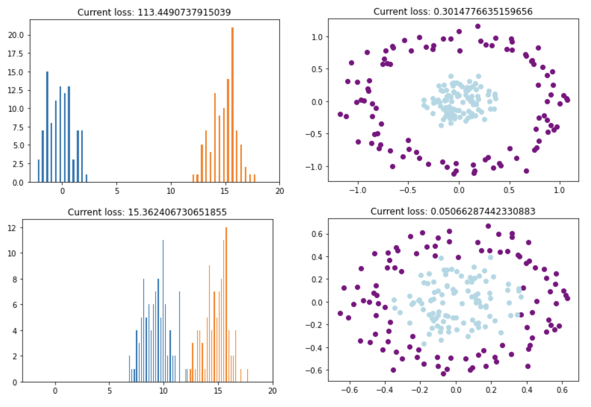

## 2021-geomloss

This repository contains a few simple basic examples showing how to use the `geomloss` library maintained by Jean Feydy: https://www.kernel-operations.io/geomloss/index.html

### Installation

From a terminal window, type `conda create -n 2021-geomloss python=3.8`

Next do `pip install numpy pykeops`. As of this writing, `pykeops` needs one to go into the installation folder (use `pip show pykeops`) and change a filename, cf. https://github.com/getkeops/keops/issues/178

Finally, running `pip install geomloss` should finish installation. Note that here we have ignored the installation of the CUDA toolkit and the nvcc compiler, which would be necessary for GPU implementations.

&nbsp;

